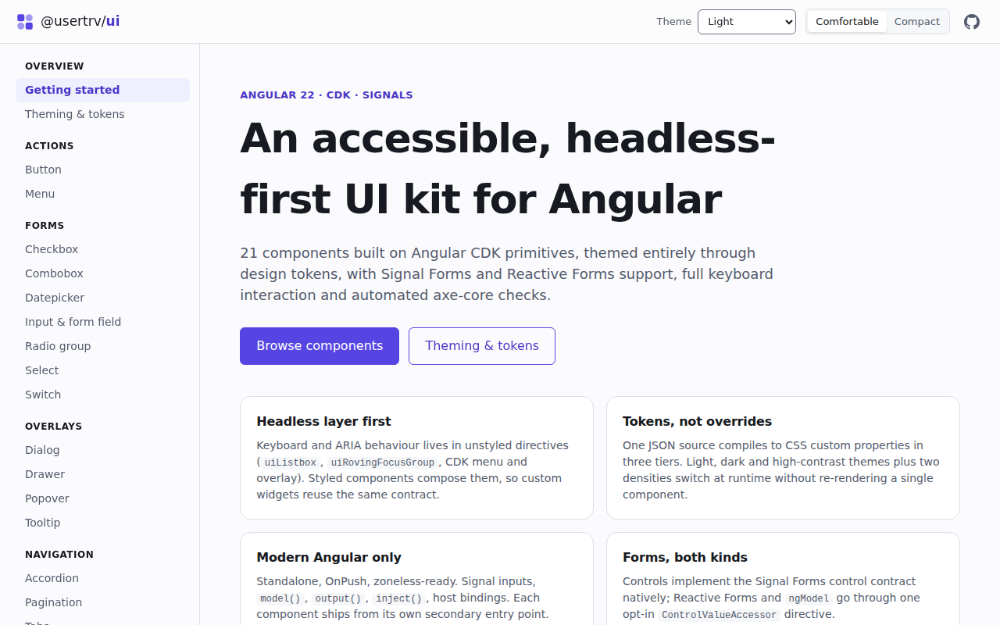
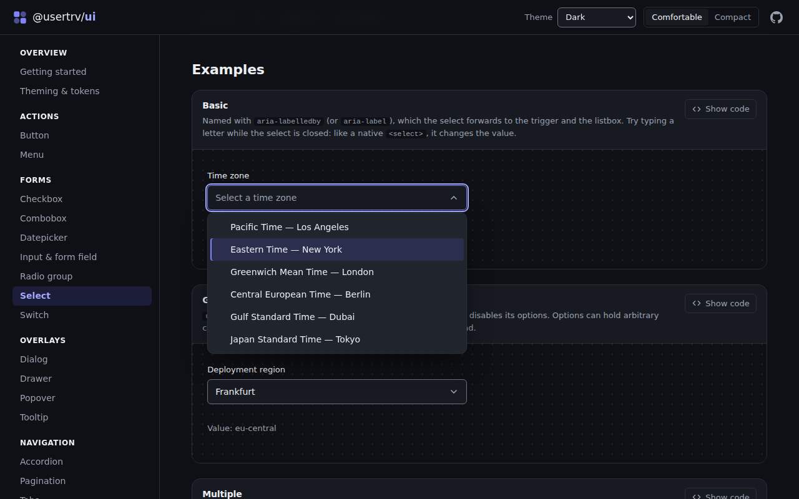
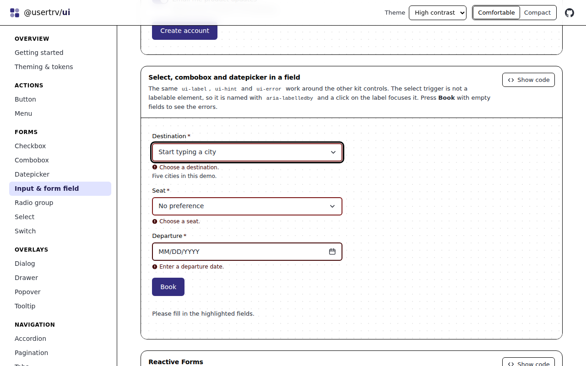
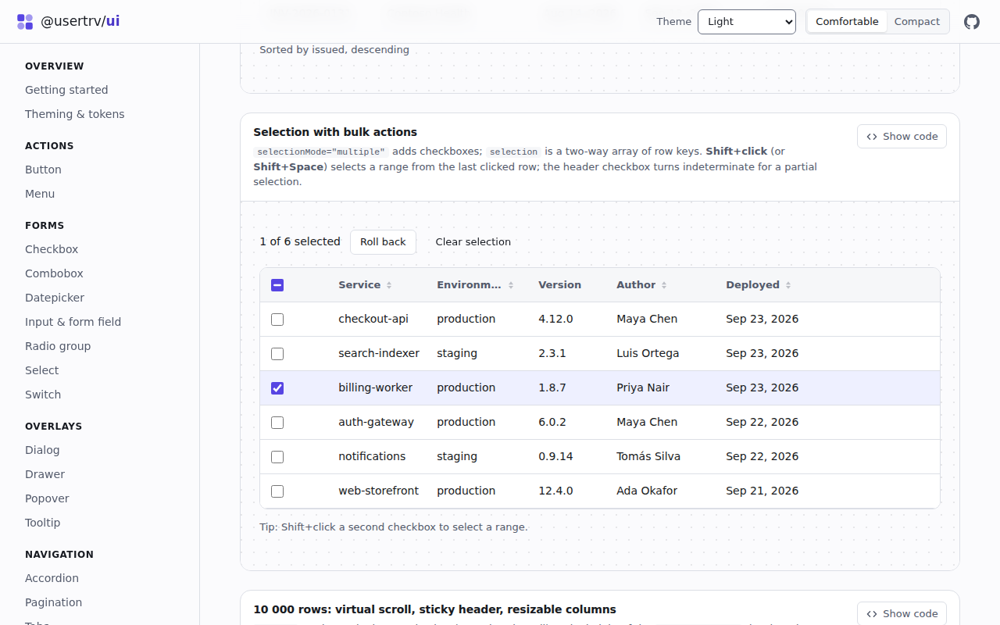
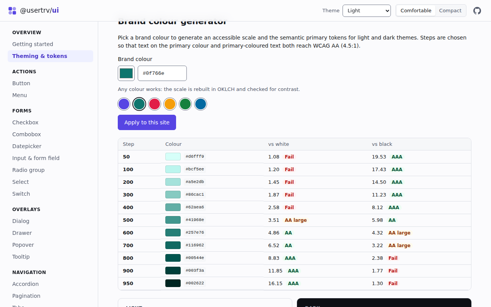
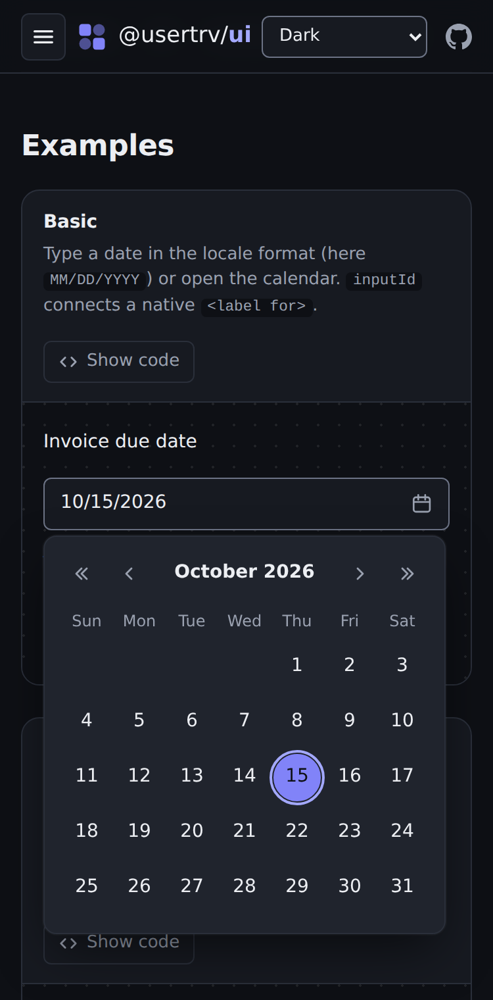
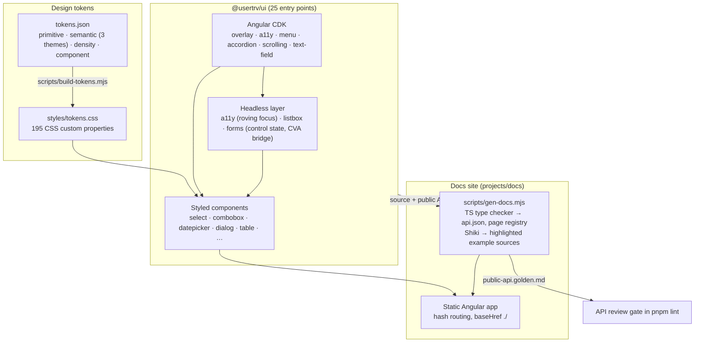

# @usertrv/ui: an Angular UI kit built on the CDK

[](https://github.com/userTrv/angular-ui-kit/actions/workflows/ci.yml)

A headless-first component library for **Angular 22**. It has 21 accessible components on top of
Angular CDK, design tokens with light, dark and high-contrast themes, two densities, and Signal Forms
and Reactive Forms support. It comes with a documentation site where every example is live.

**Live docs: https://usertrv.dev/projects/angular-ui-kit/**

> **Status: not published to npm yet.** `@usertrv/ui` is versioned with Changesets and builds as a
> normal Angular package (`pnpm build:lib` → `dist-lib/ui`), but no release has been pushed to the
> registry. To try it in another app, run `cd dist-lib/ui && npm pack` and install the tarball.



| | |
| --- | --- |
|  |  |
|  |  |

<p align="center"></p>

## Why this exists

Many design systems either wrap a heavyweight library and fight its styles, or reimplement focus
management, overlays and ARIA from scratch. This kit takes a middle path:

- **Behaviour comes from Angular CDK** (overlay, a11y, menu, accordion, virtual scroll, text-field).
  Where the CDK does not fit, a small headless layer in this repo fills the gap (`@usertrv/ui/listbox`
  for the ARIA 1.2 combobox pattern, `@usertrv/ui/a11y` for roving focus).
- **Visuals come only from CSS custom properties.** One JSON token file compiles to three tiers of
  variables. Switching theme or density at runtime sets one attribute on `<html>` and re-renders no
  Angular components.
- **Current Angular APIs only:** standalone components, `OnPush`, signal `input()`/`model()`/`output()`,
  host bindings instead of decorators, and native Signal Forms `FormValueControl` support. The docs
  app runs without zone.js.

## Components

| Category | Components | Entry point |
| --- | --- | --- |
| Actions | Button, icon button · Menu (nested submenus, checkbox and radio items) | `button`, `menu` |
| Forms | Checkbox · Combobox (static and async search) · Datepicker and date range picker · Input, textarea and form field · Radio group · Select (single, multiple, groups) · Switch | `checkbox`, `combobox`, `datepicker`, `form-field`, `radio`, `select`, `switch` |
| Overlays | Dialog (+ confirm, stacking) · Drawer · Popover · Tooltip | `dialog`, `drawer`, `popover`, `tooltip` |
| Navigation | Accordion · Pagination · Tabs | `accordion`, `pagination`, `tabs` |
| Data display | Avatar and avatar group · Badge and removable tag · Data table (sorting, selection, resizable columns, virtual scroll) | `avatar`, `badge`, `table` |
| Feedback | Skeleton · Toast (queue, actions, F8 to focus) | `skeleton`, `toast` |
| Headless | Roving focus, id helper · Listbox, option, popup · Forms bridges | `a11y`, `listbox`, `forms` |

Every entry point is imported as `@usertrv/ui/<name>`. The root `@usertrv/ui` holds only the theme
service. Each docs page has examples with their source, a generated API table, a keyboard map and
accessibility notes.

```ts
import { UiButton } from '@usertrv/ui/button';
import { UiSelect, UiSelectOption } from '@usertrv/ui/select';
import { UiFormField, UiLabel, UiError } from '@usertrv/ui/form-field';
```

```jsonc
// angular.json → projects.<app>.architect.build.options.styles
["node_modules/@angular/cdk/overlay-prebuilt.css", "node_modules/@usertrv/ui/styles/ui.css"]
```

## Architecture



- **Layering.** `ui-select` combines three layers. `uiListbox` and `uiOption` (headless) handle
  selection, `aria-activedescendant` and typeahead. `ui-option` adds the visuals as a host directive
  over `uiOption`. `ui-select` wires a `role="combobox"` trigger to all of this and implements the
  forms contract. `ui-combobox` reuses the same pieces.
- **Forms.** Every value control implements Signal Forms' `FormValueControl` or
  `FormCheckboxControl`, so `[formField]` works without an adapter. Reactive Forms and `ngModel` go
  through one opt-in `UiControlValueAccessor` directive. `injectUiControlState()` in
  `@usertrv/ui/forms` reads validity, touched and required state from either API as signals.
  `ui-form-field` finds its control through the `UI_FORM_FIELD_CONTROL` token. That lets `input[uiInput]`,
  `ui-select`, `ui-combobox` and `ui-datepicker` all take the same label, hint and error wiring.
- **Public API gate.** `scripts/gen-docs.mjs` uses the TypeScript type checker to extract every export,
  input, output and method, including inputs re-exposed from CDK `hostDirectives`. It writes
  them to `projects/ui/public-api.golden.md`. `pnpm lint` fails when that file is stale, so every API
  change shows up as a reviewed diff. The same data renders the API tables in the docs.

## Tokens and theming

```css
/* Override a semantic token for the whole app… */
:root { --ui-color-primary: #0a7d62; }
```

```html
<!-- …or scope a theme to a subtree -->
<section data-ui-theme="dark">…</section>
```

- **Primitive** tokens (`--ui-color-iris-600`, `--ui-space-4`) are raw values and never themed.
- **Semantic** tokens (`--ui-color-surface`, `--ui-color-danger-text`) have one block per theme:
  `light` (default), `dark` (also follows `prefers-color-scheme`) and `high-contrast`.
- **Density** tokens (`--ui-control-height-md`, `--ui-row-height`) come in `comfortable` and `compact`.
- **Component** tokens (`--ui-button-radius`, `--ui-drawer-width`) are re-declared under every theme
  and density attribute, so references resolve again inside scoped subtrees.
- `UiThemeService` / `provideUiTheme()` switch theme and density at runtime and persist the choice.
  The docs theming page includes a brand colour generator that builds a full scale and shows WCAG
  contrast ratios.
- Forced-colors mode (Windows High Contrast) is handled separately with system colours. Motion
  tokens drop to 0 ms under `prefers-reduced-motion`.

## Quality: measured numbers

All numbers come from this repository at the commit that added this README (Node 24.21, Chromium).

**Tests:** `pnpm test`

| Suite | Files | Tests |
| --- | ---: | ---: |
| Library (`ng test ui`: unit, component, keyboard, forms) | 42 | 398 |
| Docs (`ng test docs`: palette maths + every live example through axe-core) | 2 | 32 |
| **Total** | **44** | **430** |

- **axe-core in jsdom:** 38 `expectNoAxeViolations` call sites in the library specs, plus one axe run
  over every example on every docs page.
- **axe-core in real Chromium** (`pnpm test:a11y`): the built site is served from a sub-path
  without an SPA fallback. Every page (home, theming and 21 component pages) is checked in the light,
  dark and high-contrast themes: **69 page/theme combinations, 0 violations, 0 console errors**
  (WCAG 2.0/2.1/2.2 A and AA plus best-practice rules, including colour contrast).

**Bundle size:** `pnpm size` measures each entry point's own code after `pnpm build:lib`. It is
minified with esbuild and gzipped, with Angular, CDK, RxJS and other entry points treated as
external. The number is what importing that entry point adds to an Angular app.

| Entry point | min | min + gzip |
| --- | ---: | ---: |
| `@usertrv/ui` (theme service) | 2.3 kB | 1.0 kB |
| `@usertrv/ui/a11y` | 4.2 kB | 1.4 kB |
| `@usertrv/ui/accordion` | 12.2 kB | 2.6 kB |
| `@usertrv/ui/avatar` | 16.2 kB | 3.0 kB |
| `@usertrv/ui/badge` | 19.2 kB | 2.4 kB |
| `@usertrv/ui/button` | 9.6 kB | 2.3 kB |
| `@usertrv/ui/checkbox` | 11.9 kB | 2.4 kB |
| `@usertrv/ui/combobox` | 28.1 kB | 6.5 kB |
| `@usertrv/ui/datepicker` | 63.2 kB | 9.6 kB |
| `@usertrv/ui/dialog` | 19.1 kB | 4.4 kB |
| `@usertrv/ui/drawer` | 1.0 kB | 0.5 kB |
| `@usertrv/ui/form-field` | 22.6 kB | 3.9 kB |
| `@usertrv/ui/forms` | 3.9 kB | 1.3 kB |
| `@usertrv/ui/listbox` | 12.5 kB | 3.3 kB |
| `@usertrv/ui/menu` | 18.9 kB | 3.0 kB |
| `@usertrv/ui/pagination` | 15.9 kB | 3.1 kB |
| `@usertrv/ui/popover` | 11.5 kB | 3.3 kB |
| `@usertrv/ui/radio` | 14.5 kB | 2.9 kB |
| `@usertrv/ui/select` | 29.1 kB | 4.8 kB |
| `@usertrv/ui/skeleton` | 6.1 kB | 1.6 kB |
| `@usertrv/ui/switch` | 12.6 kB | 2.6 kB |
| `@usertrv/ui/table` | 58.2 kB | 10.9 kB |
| `@usertrv/ui/tabs` | 17.3 kB | 3.4 kB |
| `@usertrv/ui/toast` | 18.0 kB | 4.2 kB |
| `@usertrv/ui/tooltip` | 9.3 kB | 2.7 kB |

The docs site's initial bundle is 356 kB raw / 97 kB transferred (budget: 600 kB warning). Every
component page is a lazy chunk.

## Trade-offs

- **Own listbox instead of `@angular/cdk/listbox`.** `CdkListbox` moves real DOM focus into the
  list. The ARIA 1.2 combobox pattern keeps focus on the trigger or input and points at the active
  option with `aria-activedescendant`. The listbox layer here, about 450 lines, does that on top of
  CDK's `ActiveDescendantKeyManager`.
- **CSS custom properties rather than Sass mixins.** Themes switch at runtime and can be scoped to a
  subtree. The cost is that tokens are not type-checked in consumer styles. A missing token only
  shows up as a fallback.
- **`ViewEncapsulation.None` with BEM-style classes** (`.ui-select__trigger`), so consumers can style
  internals without `::ng-deep`. It also means class names are part of the styling contract.
- **Kit controls in `ui-form-field` draw their own box.** The field only adds the label, hints,
  errors and ARIA wiring. Prefix and suffix slots therefore apply only to `input[uiInput]`.
- **Hash routing in the docs** (`#/components/select`), so the static build works from any sub-path
  on any host without server rewrites. The URLs are less pretty and there is no SSR.
- **Generated docs.** API tables come from source and JSDoc, not hand-written text. They never drift,
  but a missing JSDoc comment shows up as an empty description.

## Limitations

- Not on npm (see above). Pre-1.0: the API can still change. Changes are recorded as changesets.
- English only. Datepicker parsing and formatting follow the `locale` input or `LOCALE_ID` (any
  `Intl` locale), and there are intl tokens for combobox and datepicker strings. Other components
  have no i18n support yet.
- RTL is handled in the drawer, the overlay positions, roving focus, and the calendar and table
  keyboard navigation. The docs site has no RTL switch, and RTL is not tested systematically.
- Tested in Chromium (Playwright) and jsdom. Firefox and Safari have not been tested automatically.
- SSR and hydration are not tested.
- Not included yet: tree, stepper, slider, file upload, command palette.

## Development

Requirements: Node ≥ 24.15 and pnpm 9.15.4 (`corepack enable`).

```sh
pnpm install
pnpm start          # tokens + docs data, then ng serve docs
pnpm lint           # token/API freshness checks + ESLint
pnpm test           # library and docs specs (vitest via @angular/build:unit-test)
pnpm build          # dist-lib/ui (the package) and dist/ (the static docs site, index.html at the root)
pnpm test:a11y      # axe-core in Chromium against dist/ (CHROME_PATH=… to use a local browser)
pnpm size           # per-entry-point size table (after build:lib)
pnpm changeset      # record a change to @usertrv/ui
```

`dist/` is a self-contained static site (`baseHref ./`, hash routing). It is deployed as-is to
`/projects/angular-ui-kit/` on usertrv.dev. CI (`.github/workflows/ci.yml`) runs lint, tests, the
build and the Chromium axe run on every push. When CI passes on `main`, `notify-site.yml` asks the
site repository to redeploy.

Repository layout:

```
projects/ui/        the library: one folder per entry point, tokens/, styles/, public-api.golden.md
projects/docs/      the docs app: pages/components/<slug>/{<slug>.doc.ts, examples/*.example.ts}
scripts/            build-tokens.mjs · gen-docs.mjs · a11y-e2e.mjs · size-report.mjs
docs/               README screenshots
```

## License

MIT © Kirill Levin
